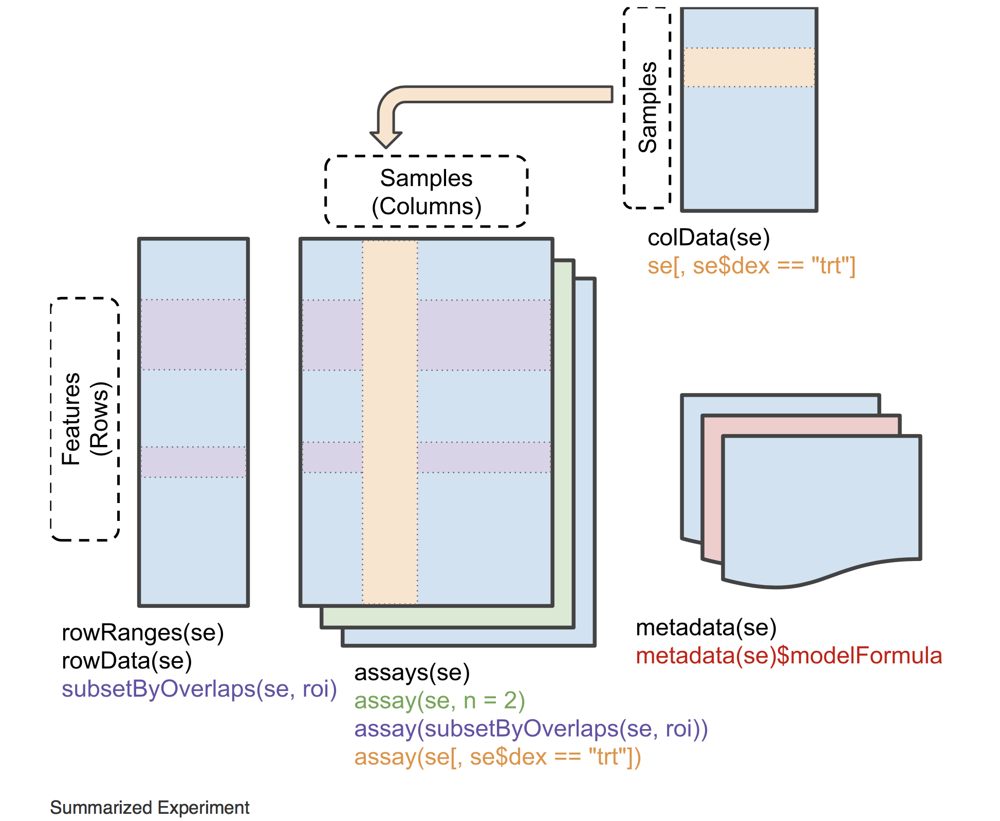
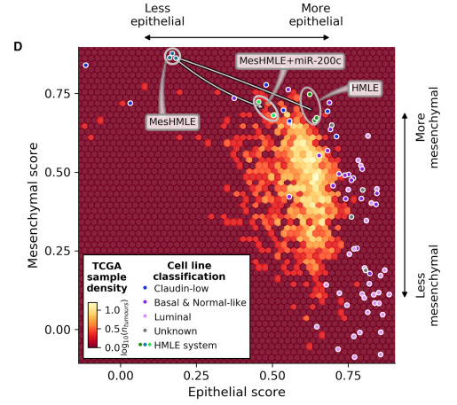

# Overview and set up
In this document, we would like to use an example project to show how we can write reports in RStudio using R Markdown. 
We use an example **gene expression data set** which includes gene expression values (n = 11900) for 10 samples, covering two conditions (Control and TGFb-treated). This data is a subset of an integrated data set from [this paper](http://mcr.aacrjournals.org/content/molcanres/15/5/619.full.pdf). We also have a expression signatures, called **TGFb-EMT signature** generated in the same paper. Both the data subset and the signature are available from the `singscore` R/Bioconductor package. 

The purpose of this project is to find samples that are more concordant with the TGFb-EMT signature. To do this, we need to use a gene-set scoring method and samples' transcriptional profiles to score samples against this signature, and then compare their scores.  

To score samples, we use the [**singscore method**](https://bmcbioinformatics.biomedcentral.com/articles/10.1186/s12859-018-2435-4), which is available as an [`R/Bioconductor package`](https://bioconductor.org/packages/release/bioc/html/singscore.html). If you are interetsed in the method, you can check the workflow paper by Bhuva *et al*, [using singscore to predict mutations in acute myeloid leukemia from transcriptomic signatures](https://f1000research.com/articles/8-776).

```{r setup, include=FALSE}
knitr::opts_chunk$set(
  echo = TRUE, 
  warning = F, 
  message = F, 
  root.dir = normalizePath("."))
```

```{r load packages}
library(knitr)
library(DT)
library(plotly)
library(singscore)
library(SummarizedExperiment)
library(GSEABase)
```

# Data and signature
The example data available through singscore package is called **tgfb_expr_10_se** and is a [`SummarizedExperiment`](https://bioconductor.org/packages/release/bioc/vignettes/SummarizedExperiment/inst/doc/SummarizedExperiment.html) object. This object can include three main components: **`assay`** (e.g. the gene expression matrix), **`rowData`** (e.g. data frame for gene information), and **`colData`** (e.g. data frame for sample information).

```{r ESummarisedExperiment, echo = FALSE, out.width = '100%', fig.cap="https://bioconductor.org/packages/release/bioc/vignettes/SummarizedExperiment/inst/doc/SummarizedExperiment.html"}

```

<br>

Looking at the head of the expression data, we see that samples are in columns, and each row represents expression of a gene, with Entrez IDs as row names.

```{r, echo = TRUE}
datatable(assay(tgfb_expr_10_se)[1:20, 1:4])
```


<br>

We would like to add more annotation file to the samples; we add these to the `colData` slot of the `tgfb_expr_10_se` object.

```{r}
tgfb_expr_10_se@colData$Replicate[grepl("R1", rownames(tgfb_expr_10_se@colData))] <- "Replicate 1"
tgfb_expr_10_se@colData$Replicate[grepl("R2", rownames(tgfb_expr_10_se@colData))] <- "Replicate 2"

tgfb_expr_10_se@colData$Study[grepl("D_", rownames(tgfb_expr_10_se@colData))] <- "Deshieri"
tgfb_expr_10_se@colData$Study[grepl("Hes_", rownames(tgfb_expr_10_se@colData))] <- "Hesling"
tgfb_expr_10_se@colData$Study[grepl("Hil_", rownames(tgfb_expr_10_se@colData))] <- "Hill"
```

<br>

We generate an interactive annotation table using DT package.

```{r}
DT::datatable(data.frame(colData(tgfb_expr_10_se)), filter = "top")
```

<br>

We can modify the style of the table format pretty easily.

```{r}
datatable(data.frame(colData(tgfb_expr_10_se))) %>%
  formatStyle("Treatment", backgroundColor = styleEqual(unique(colData(tgfb_expr_10_se)$Treatment), c("lightseagreen", "orange")))
```

The **TGFb-EMT gene expression signature** has up-regulated gene set as well as down-regulated gene-set. A sample with high evidence of TGFb-EMT signature shows high expression of the up-regulated genes and low expression of the down-regulated genes compared to samples with low evidence of this signature.
Looking at the up- and down- regulated genes, we see that they are Entrez IDs.

```{r set-up}
knitr::opts_chunk$set(warning = FALSE, message = FALSE)
```

```{r gene sets, message=FALSE}
## head of gene sets
head(geneIds(tgfb_gs_up))
head(geneIds(tgfb_gs_dn))
```

# Score samples
## Rank genes in single samples
We need to rank the expression data first. 
```{r}
rankedData <- rankGenes(expreMatrix = assay(tgfb_expr_10_se))
datatable(head(rankedData))
```

## TGFb-EMT signature score
```{r}

sigScore_tgfb <-
  simpleScore(
  rankData = rankedData,
  upSet = tgfb_gs_up,
  downSet = tgfb_gs_dn,
  subSamples = NULL,
  centerScore = T,
  dispersionFun = "MAD",
  knownDirection = T
  )

datatable(sigScore_tgfb, filter = "top")
```

### Scores vs dispersion
We visualise scores in samples with the highest and lowest scores.
```{r scores vs dispersion, fig.width = 9, fig.height = 3, message = F, warning = F}
plotDispersion(scoredf = sigScore_tgfb, 
  annot = colData(tgfb_expr_10_se)$Treatment, 
  annot_name = "Group", 
  isInteractive = T, textSize = 0.6)
```

### Rank density plots
```{r rank density plots, fig.height = 5, fig.width = 7}
plotRankDensity(
  rankData = rankedData[, "D_TGFb_R1", drop = F],
  upSet = tgfb_gs_up,
  downSet = tgfb_gs_dn,
  isInteractive = T
)

plotRankDensity(
  rankData = rankedData[, "D_Ctrl_R2", drop = F],
  upSet = tgfb_gs_up,
  downSet = tgfb_gs_dn,
  isInteractive = T
)
```


# EMT landscape 
[Cursons et al, Combinatorial Targeting by MicroRNAs Co-ordinates Post-transcriptional Control of EMT, *Cell Systems*, 2018](https://www.ncbi.nlm.nih.gov/pubmed/?term=Combinatorial+Targeting+by+MicroRNAs+Co-ordinates+Post-transcriptional+Control+of+EMT)
```{r EMT landscape, echo = FALSE, fig.cap = "Epithelial-Mesenchymal landscape from Cursons et al paper published in Cell Systems", out.width = '100%'}

```

## Epithelial and Mesenchymal signatures' scores
We read epithelial and mesenchymal signatures from [Tan *et al*](https://www.ncbi.nlm.nih.gov/pubmed/25214461). The signatures have been extracted from the paper and are saved under the data folder.There are separate epithelial and mesenchymal signatures for cell lines and tumour data.
```{r}
emt <- read.table("../data/Thiery_EMTsignature_both_tumour_cellLine_EntrezIDs.txt", header = T, sep = "\t")

epi <- emt$EntrezGene.ID[emt$epiMes_cellLine == "epi" ]
mes <- emt$EntrezGene.ID[emt$epiMes_cellLine == "mes" ]

epi <- epi[complete.cases(epi)]
mes <- mes[complete.cases(mes)]
```

We score samples using epithelial and mesenchymal signatures. These are expected up-regulated gene sets.
```{r epi and mes scoring, warning = F, message = F}
sigScore_epi <-
  simpleScore(
  rankData = rankedData,
  upSet = epi,
  subSamples = NULL,
  centerScore = T,
  dispersionFun = "MAD",
  knownDirection = T
  )

sigScore_mes <-
  simpleScore(
  rankData = rankedData,
  upSet = mes,
  subSamples = NULL,
  centerScore = T,
  dispersionFun = "MAD",
  knownDirection = T
  )
```

Here, I load the epithelial and mesenchymal scores for the TCGA breast cancer data. I have already downloaded the TCGA data, calculated the RPKM values, and scored samples. To see how to do all these on the TCGA data, see the workflow paper by [Bhuva *et al*](https://f1000research.com/articles/8-776).
```{r generate overlaid landscape plot, fig.height = 6, fig.width = 7}
TCGA_EMTscore <- readRDS('../data/TCGA_BrCr_EMT_score_rmIDs.RDS')

p2 <- plotScoreLandscape(
  scoredf1 = TCGA_EMTscore$TCGA_BrCr_Epi,
  scoredf2 = TCGA_EMTscore$TCGA_BrCr_Mes,
  scorenames = c("Epithelial", "Mesenchymal")
  )

projectScoreLandscape(
  plotObj = p2,
  scoredf1 = sigScore_epi[1:4, ],
  scoredf2 = sigScore_mes[1:4, ],
  annot = colData(tgfb_expr_10_se)$Treatment[1:4],
  annot_name = "Group",
  sampleLabels = colnames(rankedData)[1:4],
  isInteractive = T
  )
```


# Interactive plot independent of singscore 
## Using ggplotly
You only need to pass a ggplot object to `ggplotly` to get the inteactivity. You could 
```{r ggplotly, fig.height = 6, fig.width = 7}
## p2 is a ggplot object
tcagScores <- data.frame(cbind(
  sc1 = TCGA_EMTscore$TCGA_BrCr_Epi$TotalScore, 
  sc2 = TCGA_EMTscore$TCGA_BrCr_Mes$TotalScore), 
  check.names = F)

p2.0 <- ggplot(data = tcagScores, aes(sc1, sc2)) +
  geom_hex() + 
  xlab("Epithelial")+
  ylab("Mesenchymal")

ggplotly(p2.0)
```

We can also project the cell line scores on top of it.
```{r manually add projections, fig.height = 6, fig.width = 7}
annot <- colData(tgfb_expr_10_se)$Treatment[1:4]
annot_name <- "Group"
sampleLabels <- colnames(rankedData)[1:4]

newdata <- data.frame(
    'sc1' = sigScore_epi[1:4, "TotalScore"],
    'sc2' = sigScore_mes[1:4, "TotalScore"],
    'SampleLabel' = sampleLabels,
    'Class' = annot
  )

p3 <- p2.0 +
  geom_point(
    aes(text = SampleLabel, colour = Class),
    shape = 21,
    fill = 'white',
    size = 2,
    stroke = 2,
    data = newdata
  ) + 
  scale_colour_brewer(palette = 'Dark2') +
  labs(colour = annot_name)

ggplotly(p3)
```

# Session information
```{r}
sessionInfo()
```


