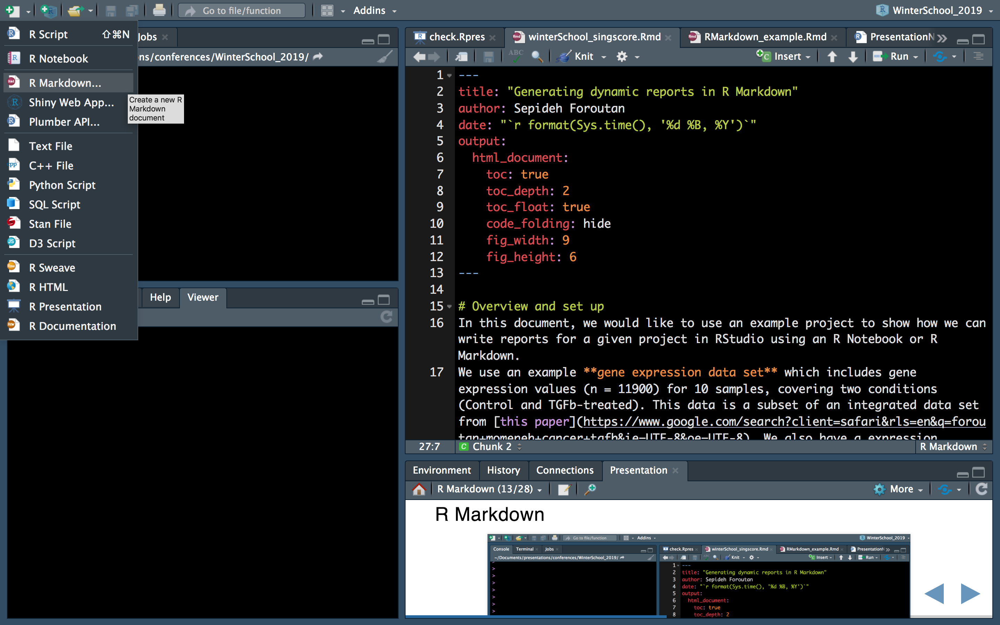
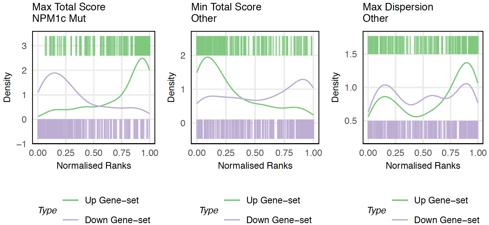
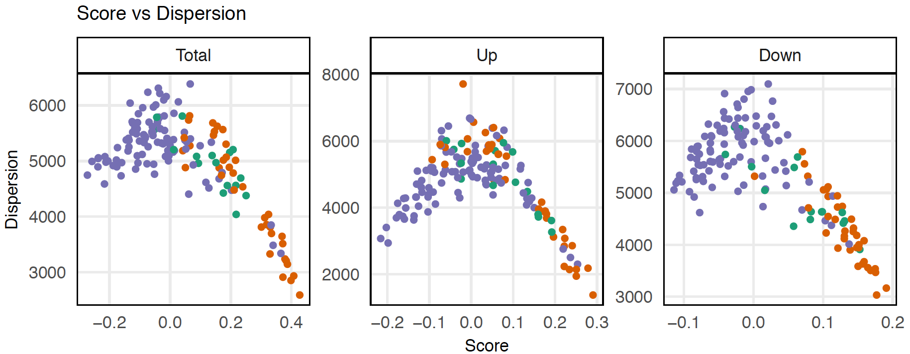
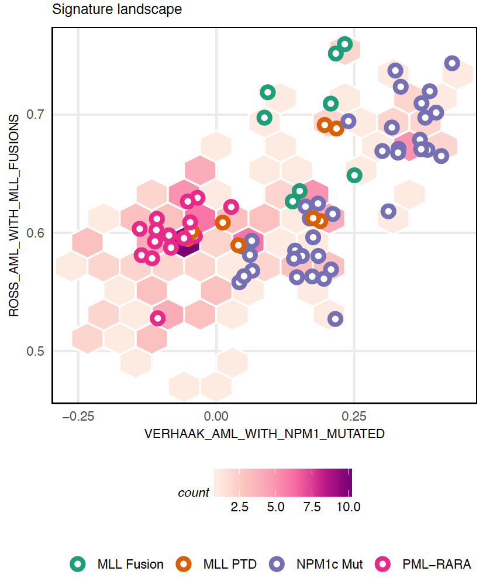

```{r setup, include=FALSE}
options(htmltools.dir.version = FALSE)
```

# About me and R

- Background in Molecular Genetics (BSc and MSc)

- PhD in Computational Cancer Biology

- Self teaching R through on-line courses 

--

- Co-founder of [R-Ladies Melbourne](https://www.meetup.com/R-Ladies-Melbourne/events/past/) in Sep 2016 

- President of R-Ladies Melbourne Inc.

```{r, echo=FALSE, fig.cap="https://www.meetup.com/en-AU/rladies-melbourne/", out.width = '70%'}

```

---
# R-Ladies 
```{r, echo=FALSE, fig.cap="https://blog.revolutionanalytics.com/2018/12/women-and-r.html", out.width = '100%'}

```

---
class: inverse, center, middle
# Motivation 

---
# Imagine a project ...
**You are given:**
- Gene expression data for some cancer samples

- A gene experssion signature 

**You are asked to:**
- Find out which samples are more concordant with that signature?

- Communicate the analyses with your colleagues

---
# How I used to do these without R Markdown

I would have:

- a folder with several analysis **scripts**

- a folder with several **figures**

- a folder with several **tables** (e.g. .csv, txt, tsv, etc)

- a **notebook** storing all the notes (rationale of the analyses, methodology, interpretation and descriptions)

- a folder of **papers** that have relevant figures and information. 

--

- **It was always pretty hectic to *communicate* all these information with colleagues, *reproduce* all the results, and *share* my analyses.**

---
# R Markdown was a game changer!

R Markdown is an authoring framework provided by RStudio, which can keep all steps of the analyses together:

- Codes (save and execute)

- Figures and tables

- Methodology, interprations, and descriptions of the analyses

- Link to papers, and images from papers

--

- **It is now much eaier to *communicate* all these information with colleagues, *reproduce* all the results, and *share* my analyses.**
- **Several output formats, and possibilities for static and dynamic (interactive) reports.** 

---
# RStudio
RStudio is an integrated development environment (IDE) for R which includes a console, syntax-highlighting editor, and tools for plotting, history, debugging, etc. Rstudio help you to interact with R more readily.

```{r, echo=FALSE, fig.align="center", out.width = '100%', fig.cap =""}
knitr::include_graphics("./images/RStudio.png") 
```
---
# Things you can do using RStudio
- Write, save and run codes

- Generate interactive web application

- Generate high quality reports and documents 

- Making presentation slides

- Version control (Git/Github)

- Many more

--

- [**RStudio website**](https://www.rstudio.com)

- [**Introduction to R and RStudio**](http://ncss-tech.github.io/stats_for_soil_survey/chapters/1_introduction/1_introduction.html)

- [**RStudio cheatsheet**](https://www.rstudio.com/wp-content/uploads/2016/01/rstudio-IDE-cheatsheet.pdf)

---
# Online courses

[**Data Science Specialisation by JHU on Coursera**](https://www.coursera.org/specializations/jhu-data-science)


---
# R Markdown and knitr

R Markdown (.Rmd) combines **R codes** (.R) and **documentatiuon language** (.md) using **knitr**.

**knitr** ...
- inspired by Sweave
- is an R package which works as an engine for dynamic report generation in R. 
- helps us to integrate R codes into other documents (e.g. Markdown, LaTeX, HTML, etc).
- can generate HTML, PDF or Word documents.
- supports other languages, such as Python, Perl, C++, Shell scripts, etc.
- enables reproducible research

---
# R Markdown main sections
YAML header, Markdown text, and code chunks (with outputs).

```{r, echo=FALSE, fig.align="center", out.width = '90%', fig.cap =""}
knitr::include_graphics("./images/RMarkdown_sections.png") 
```

---
# Open a new R Markdown
```{r, echo=FALSE, fig.align="center", out.width = '100%', fig.cap =""}
 
```

---
# Open a new R Markdown
```{r, echo=FALSE, fig.align="center", out.width = '100%', fig.cap =""}
 
```

---
# Open a new R Markdown
```{r, echo=FALSE, fig.align="center", out.width = '100%', fig.cap =""}
knitr::include_graphics("./images/RMarkdown_start3.png") 
```

---
# Open a new R Markdown
```{r, echo=FALSE, fig.align="center", out.width = '100%', fig.cap =""}
 
```

---
# Open a new R Markdown
```{r, echo=FALSE, fig.align="center", out.width = '100%', fig.cap =""}
knitr::include_graphics("./images/RMarkdown_knit2.png") 
```

---
# R Notebook

An [**R Notebook**](https://bookdown.org/yihui/rmarkdown/notebook.html#fig:notebook-demo) is an R Markdown document with chunks that can be executed independently and interactively, with output visible immediately beneath the input.
- **R Markdown** (knitr botton): executes and evaluates all code in one go. It can be very time-consuming when we have heavy processing
- **R Notebook** (preview botton): has caching behaviour; it evaluates a code chunk and save it. 

"The immediacy of notebook mode makes it a good choice while authoring the R Markdown document and iterating on code. When you are ready to publish the document, you can share the notebook directly, or render it to a publication format with the Knit button."

---
# R Markdown and R Notebook
.pull-left[
- [R Markdown](https://rmarkdown.rstudio.com)
  + **knit** botton
  + output: **html_document**

```{r, echo=FALSE, fig.align="center", out.width = '100%', fig.cap =""}
 
```
]

.pull-right[
- [R Notebook](https://bookdown.org/yihui/rmarkdown/notebook.html) 
  + **preview** botton
  + output: **html_notebook**
  
```{r, echo=FALSE, fig.align="center", out.width = '100%', fig.cap =""}
knitr::include_graphics("./images/Rnotebook_example.png") 
```
]

---
# How does it look when we knit?
```{r, echo=FALSE, fig.align="center", out.width = '90%', fig.cap ="https://github.com/DavisLaboratory/NK_scoring/"}
 
```

---
class: inverse
# Creating the document
.pull-top[
- Modify YAML header
- Structure and format the text
- Insert and modify code chuncks
- Generate interactive tables
- Generate interactive figures
]
.pull-bottom[

```{r, echo=FALSE, fig.align="left", out.width = '100%', fig.cap =""}
 
```

]
---
# YAML header

"YAML (YAML Ain't Markup Language) is a human-friendly data serialization standard for all programming languages."

YAML header allows us to modify the output of the domunent; YAML section can evaluate R expressions.
By modifying the YAML header, we can add/change:
- Output format
- Table of content (toc)
- Tabbed sections 
- Global figure options (width and height)
- Custom CSS
- a lot more

---
# YAML header
.pull-top[
```{r, echo=FALSE, fig.align="center", out.width = '70%', fig.cap =""}
 
```
]
.pull-bottom[
```{r, echo=FALSE, fig.align="center", out.width = '70%', fig.cap =""}
knitr::include_graphics("./images/YAML_code_hide.png") 
```
]

---
# YAML header
.pull-top[
```{r, echo=FALSE, fig.align="center", out.width = '70%', fig.cap =""}
 
```
]
.pull-bottom[
```{r, echo=FALSE, fig.align="center", out.width = '70%', fig.cap =""}
 
```
]

---
# Structure and modify the text

.pull-left[
- Headings and sub-headings are generated using **#**:

`# Heading 1`
# Heading 1

`## Heading 2` 
## Heading 2
]

.pull-right[
- Italic texts are generated using * *:

`*This is italic!*` 

*This is italic!*

- Bold texts are generated using ** **:

`**This is bold!**` 

**This is bold!**
]

---
# Structure and modify the text

- Add hyperlinks using `[your_text](your_url)`; for example:

`[R Markdown documnetation](https://rmarkdown.rstudio.com)` will make [R Markdown documnetation](https://rmarkdown.rstudio.com) clickable, which opens up the corresponding webpage for the documentation.

- Use **single backticks** as wrappers to change the font to make the code, package names, etc different from other plain texts.

- Add bullet points using **minus** and **plus** signs as well as tab.

.pull-left[
For example:

`-` First point

Tab `+` class A

Tab `+` class B

`-` Second point

]

.pull-right[
Will result in:

- First point
  + class A
  + class B
- Second point

]


---
# Code chunks

```{r, echo=FALSE, fig.align="center", out.width = '65%', fig.cap =""}
 
```

--

```{r, echo=FALSE, fig.align="center", out.width = '65%', fig.cap =""}
knitr::include_graphics("./images/code_chunks2.png") 
```

--

```{r, echo=FALSE, fig.align="center", out.width = '65%', fig.cap =""}
 
```

---
# Insert/run code chunks

.pull-left[
```{r, echo=FALSE, fig.align="center", out.width = '100%', fig.cap =""}
knitr::include_graphics("./images/Rnotebook_example.png") 
```
]

--

.pull-right[
```{r, echo=FALSE, fig.align="center", out.width = '80%', fig.cap =""}
knitr::include_graphics("./images/code_chunks_bottons1.png") 
```


- In Mac: Command + Option + i
- In Windows: Ctrl + Alt + i

]

---
# Insert/run code chunks
.pull-left[
```{r, echo=FALSE, fig.align="center", out.width = '100%', fig.cap =""}
knitr::include_graphics("./images/Rnotebook_example.png") 
```
]

.pull-right[
```{r, echo=FALSE, fig.align="center", out.width = '80%', fig.cap =""}
knitr::include_graphics("./images/code_chunks_bottons2.png") 
```
]

---
# Interactive tables using DT package

.pull-left[
- Interface to the DataTable javascript library
- Very easy-to-use: `datatable(df)`
- filtering, paging, sorting, formatting the tables, etc.
- [DT documentation](https://rstudio.github.io/DT/)
]

--

.pull-right[
```{r, echo=FALSE, fig.align="left", out.width = '100%', fig.cap =""}
knitr::include_graphics("./images/DT_example_code.png") 
```
]

```{r, echo=FALSE, fig.align="center", out.width = '80%', fig.cap =""}
 
```

---
# Interactive plots using plotly package

- Plotly can generate 2D and 3D plots, as well as animations

- It is possible to zoom, pan, label, and toggle between items in the legend 

- Save static image functionality

- Configurable tooltips

- Very easy-to-use with **ggplot**: `ggplotly(ggplot_object)`

- [Plotly documentation](https://plot.ly/r/)

---
class: inverse
# Back to our theoritical project...

Use samples' gene expression data and a gene set scoring method to score samples against gene sets and identify those that are more concordant with a given signature. 

--

<br>

.pull-left[
```{r, echo=FALSE, fig.align="center", out.width = '70%', fig.cap =""}
knitr::include_graphics("./images/Singscore_logo.png") 
```
]

.pull-right[
<br>
- Rank-based method

- Single-sample approach 

- R/Bioconductor package

- Interactive plots
]


---
# The singscore method
```{r, echo=FALSE, fig.align="center", out.width = '91%', fig.cap =""}
knitr::include_graphics("./images/singscore_workflow.png") 
```

<br>
<small>[Single sample scoring of molecular phenotypes. Foroutan M, Bhuva D, et al. *BMC Bioinformatics*](https://bmcbioinformatics.biomedcentral.com/articles/10.1186/s12859-018-2435-4)</small>

---
# Visualisations by `singscore`


```{r, echo=FALSE, fig.align="center", out.width = '70%', fig.cap =""}
 
```
--
```{r, echo=FALSE, fig.align="center", out.width = '70%',  fig.cap =""}
 
```
<small>[Using singscore to predict mutations in AML from transcriptomic signatures. Bhuva D. et al. *f1000 research*](https://bioconductor.org/packages/release//workflows/vignettes/SingscoreAMLMutations/inst/doc/workflow_transcriptional_mut_sig.html).</small>

---
# Visualisations by `singscore`

```{r, echo=FALSE, fig.align="center", out.width = '50%', fig.cap =""}
 
```
<small>[Using singscore to predict mutations in AML from transcriptomic signatures. Bhuva D. et al. *f1000 research*](https://bioconductor.org/packages/release//workflows/vignettes/SingscoreAMLMutations/inst/doc/workflow_transcriptional_mut_sig.html).</small>

---
class: inverse, middle, center
# Let's look at our R Markdown report 

[**Generating dynamic reports in R Markdown - an example using singscore**](file:///Users/foroutanm/Documents/presentations/conferences/WinterSchool_2019_Brisbane/Slides/analysis/winterSchool_singscore.html)

---
# Resources I used for this presentation

- [**RStudio website**](https://www.rstudio.com)
- [**R Markdown documentation**](https://rmarkdown.rstudio.com)
- [**R Notebook documentation**](https://bookdown.org/yihui/rmarkdown/notebook.html#fig:notebook-demo)
- [**Baby one more time - Reproducibility in R and when to pull in the big guns** by *Lavinia Gordon*](https://mrslaviniag.github.io/xaringan_presentations/rladies_presentation_22_May_2019.html)

- [**RLadies presentation Ninja** by *Alison Presmanes Hill*](https://alison.rbind.io/slides/rladies-demo-slides.html)
- [**Making slides in R Markdown** by *Alison Hill*](https://arm.rbind.io/slides/xaringan.html)

---
class: inverse, center, middle
# Thank you! 
