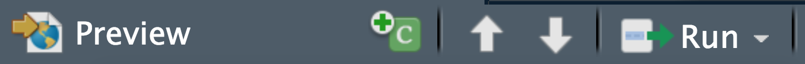

```{r setup, include=FALSE}
options(htmltools.dir.version = FALSE)
```

# About me and R

- Background in Molecular Genetics (BSc and MSc)
- Self teaching R through on-line courses 
- PhD in Computational Cancer Biology


--

- [R-Ladies](https://rladies.org): A world-wide organisation to promote gender diversity in the R community.
<br> <br> <br>

```{r, echo=FALSE, out.width = '50%', fig.align = "center"}
knitr::include_graphics("./images/RLadies_logo.png")
```

---
# About me and R

- Background in Molecular Genetics (BSc and MSc)
- Self teaching R through on-line courses 
- PhD in Computational Cancer Biology
<br><br>
- Co-founder of [R-Ladies Melbourne](https://www.meetup.com/R-Ladies-Melbourne/events/past/) in Sep 2016 
- President of R-Ladies Melbourne Inc.
- More than 1200 members

```{r, echo=FALSE, fig.cap="https://www.meetup.com/en-AU/rladies-melbourne/", out.width = '70%', fig.align = "center"}
knitr::include_graphics("./images/RLadies_meetup.png")
```

---
# R-Ladies chapters
- There are 158 chapters in 46 countries.

- Other chapters in Australia: **Brisbane**, Sydney, Adelaide, Canberra, and Perth

```{r, echo=FALSE, fig.cap="https://blog.revolutionanalytics.com/2018/12/women-and-r.html", out.width = '80%', fig.align = "center"}
knitr::include_graphics("./images/RLadies_map.png")
```

---
class: inverse, center, middle
# Why generating reports in R Markdown?

---
# Imagine a project ...
**You are given:**
- Gene expression data for some cancer samples

- A gene experssion signature 

**You are asked to:**
- Find out which samples are more concordant with that signature?

- Communicate the analyses with your colleagues

---
# How I used to do these without R Markdown

I would have:

- a folder with several analysis **scripts**

- a folder with several **figures**

- a folder with several **tables** (e.g. .csv, txt, tsv, etc)

- a **notebook** storing all the notes (rationale of the analyses, methodology, interpretation and descriptions)

- a folder of **papers** that have relevant figures and information. 

--

- **It was always pretty hectic to *communicate* all these information with colleagues, *reproduce* all the results, and *share* my analyses.**

---
# R Markdown was a game changer!

R Markdown is an authoring framework provided by RStudio, which can keep all steps of the analyses together:

- Codes (save and execute)

- Figures and tables

- Methodology, interprations, and descriptions of the analyses

- Link to papers, and images from papers

--

- **It is now much eaier to *communicate* all these information with colleagues, *reproduce* all the results, and *share* my analyses.**
- **Several output formats, and possibilities for static and dynamic (interactive) reports.** 

---
# RStudio
RStudio is an integrated development environment (IDE) for R which includes a console, syntax-highlighting editor, and tools for plotting, history, debugging, etc. Rstudio help you to interact with R more readily.

```{r, echo=FALSE, fig.align="center", out.width = '100%', fig.cap =""}
 
```
---
# Things you can do using RStudio
- Write, save and run codes

- Generate interactive web application

- Generate high quality reports and documents 

- Making presentation slides

- Version control (Git/Github)

- Many more

--

- [**RStudio website**](https://www.rstudio.com)

- [**Introduction to R and RStudio**](http://ncss-tech.github.io/stats_for_soil_survey/chapters/1_introduction/1_introduction.html)

- [**RStudio cheatsheet**](https://www.rstudio.com/wp-content/uploads/2016/01/rstudio-IDE-cheatsheet.pdf) as well as [**many cheatsheets**](https://www.rstudio.com/wp-content/uploads/2019/01/Cheatsheets_2019.pdf) by RStudio.

- [**"Where to get help with your R questions?"** by *Maëlle Salmon*](https://masalmon.eu/2018/07/22/wheretogethelp/)


---
# R Markdown and knitr

R Markdown (.Rmd) combines **R codes** (.R) and **documentatiuon language** (.md) using **knitr**.

**knitr** ...
- is an R package which works as an **engine for dynamic report generation** in R. 

- inspired by **Sweave** (R code + LaTeX)

- helps us to integrate R codes into other **documents** (e.g. Markdown, LaTeX, HTML, etc).

- can generate HTML, PDF or Word documents.

- supports **other languages**, such as Python, Perl, C++, Shell scripts, etc.

---
# Open a new R Markdown
```{r, echo=FALSE, fig.align="center", out.width = '100%', fig.cap =""}
knitr::include_graphics("./images/RMarkdown_start.png") 
```

---
# Open a new R Markdown
```{r, echo=FALSE, fig.align="center", out.width = '100%', fig.cap =""}
knitr::include_graphics("./images/RMarkdown_start2.png") 
```

---
# Open a new R Markdown
```{r, echo=FALSE, fig.align="center", out.width = '100%', fig.cap =""}
 
```

---
# Open a new R Markdown
```{r, echo=FALSE, fig.align="center", out.width = '100%', fig.cap =""}
knitr::include_graphics("./images/RMarkdown_knit.png") 
```

---
# Open a new R Markdown
```{r, echo=FALSE, fig.align="center", out.width = '100%', fig.cap =""}
 
```

---
class: inverse
# R Markdown has three main sections
.pull-top[
1. YAML header
3. Text 
3. Code chunks
<br>
]
.pull-bottom[
```{r, echo=FALSE, fig.align="left", out.width = '100%', fig.cap =""}
knitr::include_graphics("./images/RMarkdown_example2.png") 
```
]

--

- Interactive tables
- Interactive figures
--

- [**R Markdown cheatsheet**](https://www.rstudio.com/wp-content/uploads/2016/03/rmarkdown-cheatsheet-2.0.pdf)

---
# YAML header
A YAML header is a set of key:value pairs at the start of the file, which starts and ends with a line of three dashes (`---`).

The meta data in the YAML header allows us to modify the output of the domunent; we can add/change:
- output format
- table of content (toc)
- tabbed sections 
- global figure options (width and height)
- custom CSS (Cascading Style Sheets)
- a lot more


---
# YAML header
.pull-top[
```{r, echo=FALSE, fig.align="center", out.width = '70%', fig.cap =""}
knitr::include_graphics("./images/YAML.png") 
```
]
.pull-bottom[
```{r, echo=FALSE, fig.align="center", out.width = '70%', fig.cap =""}
 
```
]

---
# YAML header
.pull-top[
```{r, echo=FALSE, fig.align="center", out.width = '70%', fig.cap =""}
knitr::include_graphics("./images/YAML.png") 
```
]
.pull-bottom[
```{r, echo=FALSE, fig.align="center", out.width = '70%', fig.cap =""}
knitr::include_graphics("./images/YAML_code_show.png") 
```
]

---
# Structure and modify the text

.pull-left[
- Headings and sub-headings are generated using **#**:

`# Heading 1`
# Heading 1

`## Heading 2` 
## Heading 2
]

.pull-right[
- Italic texts are generated using * *:

`*This is italic!*` 

*This is italic!*

- Bold texts are generated using ** **:

`**This is bold!**` 

**This is bold!**
]

---
# Structure and modify the text

- Add links using `[your_text](url)`; for example:

`[R Markdown documnetation](https://rmarkdown.rstudio.com)` will make [R Markdown documnetation](https://rmarkdown.rstudio.com) clickable, which opens up the corresponding webpage for the documentation.

--

- Add bullet points using `*`, **-** or **+**

.pull-left[
For example:

`*` First point

Tab `+` class A

Tab `+` class B

`-` Second point

]

.pull-right[
Will result in:

* First point
  + class A
  + class B
- Second point

]


---
# Code chunks

```{r, echo=FALSE, fig.align="center", out.width = '65%', fig.cap =""}
 
```

---
# Code chunks

```{r, echo=FALSE, fig.align="center", out.width = '65%', fig.cap =""}
knitr::include_graphics("./images/code_chunks1.png") 
```

--

```{r, echo=FALSE, fig.align="center", out.width = '65%', fig.cap =""}
 
```

--

```{r, echo=FALSE, fig.align="center", out.width = '65%', fig.cap =""}
knitr::include_graphics("./images/code_chunks3.png") 
```

---
# Insert/run code chunks

.pull-left[
```{r, echo=FALSE, fig.align="center", out.width = '100%', fig.cap =""}
knitr::include_graphics("./images/Rnotebook_example.png") 
```
]

--

.pull-right[
```{r, echo=FALSE, fig.align="center", out.width = '80%', fig.cap =""}
 
```


- In Mac: Command + Option + i
- In Windows: Ctrl + Alt + i

]

---
# Insert/run code chunks
.pull-left[
```{r, echo=FALSE, fig.align="center", out.width = '100%', fig.cap =""}
knitr::include_graphics("./images/Rnotebook_example.png") 
```
]

.pull-right[
```{r, echo=FALSE, fig.align="center", out.width = '80%', fig.cap =""}
 
```

- In Mac: Command + Shift + Return
- In Windows: Ctrl + Shift + Enter
]


---
# Interactive tables using DT package

.pull-left[
- Interface to the DataTable javascript library
- Very easy-to-use: `datatable(df)`
- filtering, paging, sorting, formatting the tables, etc.
- [DT documentation](https://rstudio.github.io/DT/)
]

--

.pull-right[
```{r, echo=FALSE, fig.align="left", out.width = '100%', fig.cap =""}
knitr::include_graphics("./images/DT_example_code.png") 
```
]

```{r, echo=FALSE, fig.align="center", out.width = '80%', fig.cap =""}
knitr::include_graphics("./images/DT_example_plot.png") 
```

---
# Interactive plots using plotly package

- Plotly can generate 2D and 3D plots, as well as animations

- It is possible to zoom, pan, label, and toggle between items in the legend 

- Save static image functionality

- Configurable tooltips

- Very easy-to-use with **ggplot**: `ggplotly(ggplot_object)`

- [Plotly documentation](https://plot.ly/r/)

---
class: inverse
# Back to our theoritical project...

Use samples' gene expression data and a gene set scoring method to score samples against gene sets and identify those that are more concordant with a given signature. 

--

<br>

.pull-left[
```{r, echo=FALSE, fig.align="center", out.width = '70%', fig.cap =""}
knitr::include_graphics("./images/Singscore_logo.png") 
```
]

.pull-right[

 Singscore: gene-set scoring method
- Rank-based method

- Single-sample approach 

- R/Bioconductor package

- Interactive plots
]

<small>[Single sample scoring of molecular phenotypes. Foroutan M, Bhuva D, et al. *BMC Bioinformatics*](https://bmcbioinformatics.biomedcentral.com/articles/10.1186/s12859-018-2435-4)</small>
---
# The singscore method
```{r, echo=FALSE, fig.align="center", out.width = '91%', fig.cap =""}
 
```

<br>
<small>[Single sample scoring of molecular phenotypes. Foroutan M, Bhuva D, et al. *BMC Bioinformatics*](https://bmcbioinformatics.biomedcentral.com/articles/10.1186/s12859-018-2435-4)

[Using singscore to predict mutations in acute myeloid leukemia from transcriptomic signatures. Bhuva D, et al. *f1000Research*](https://f1000research.com/articles/8-776)

</small>


---
# Overview of data and signatures

```{r, echo=FALSE, fig.align="center", out.width = '50%', fig.cap =""}
 
```
### Data sets
- An example **gene expression data set** for 10 samples (cancer cell lines), covering two conditions (Control and TGFb-treated). This data is a subset of an integrated data set from [Foroutan *et al*](http://mcr.aacrjournals.org/content/molcanres/15/5/619.full.pdf). 
- Gene expression data for patients from [TCGA](https://www.cancer.gov/about-nci/organization/ccg/research/structural-genomics/tcga) data

### Signatures
- **TGFb-EMT signature** from [Foroutan *et al*](http://mcr.aacrjournals.org/content/molcanres/15/5/619.full.pdf).
- **Epithelial** and **Mesenchymal** signatures from [Tan *et al*](https://www.ncbi.nlm.nih.gov/pubmed/25214461).

---
class: inverse, middle, center
# Let's look at our R Markdown report 

---
# Resources

- [**RStudio website**](https://www.rstudio.com)
- [**R Markdown documentation**](https://rmarkdown.rstudio.com)
- [**R Notebook documentation**](https://bookdown.org/yihui/rmarkdown/notebook.html#fig:notebook-demo)
- [**Baby one more time - Reproducibility in R and when to pull in the big guns** by *Lavinia Gordon*](https://mrslaviniag.github.io/xaringan_presentations/rladies_presentation_22_May_2019.html)
- [**RLadies presentation Ninja** by *Alison Hill*](https://alison.rbind.io/slides/rladies-demo-slides.html)
- [**Making slides in R Markdown** by *Alison Hill*](https://arm.rbind.io/slides/xaringan.html)


- [Using singscore to predict mutations in acute myeloid leukemia from transcriptomic signatures, *f1000 Research*, 2019](https://f1000research.com/articles/8-776)
- [Single-sample scoring of Molecular phenotypes, *BMC Bioinformatics*, 2018.](https://bmcbioinformatics.biomedcentral.com/articles/10.1186/s12859-018-2435-4)
- [Combinatorial Targeting by MicroRNAs Co-ordinates Post-transcriptional Control of EMT, *Cell Systems*, 2018](https://www.ncbi.nlm.nih.gov/pubmed/?term=Combinatorial+Targeting+by+MicroRNAs+Co-ordinates+Post-transcriptional+Control+of+EMT)
- [A Transcriptional Program for Detecting TGFb-Induced EMT in Cancer, *Molecular Cancer Research, 2017*](http://mcr.aacrjournals.org/content/molcanres/15/5/619.full.pdf). 
- [*Epithelial-mesenchymal transition spectrum quantification and its efficacy in deciphering survival and drug responses of cancer patients.*](https://www.ncbi.nlm.nih.gov/pubmed/25214461).
- [TCGA ](https://www.cancer.gov/about-nci/organization/ccg/research/structural-genomics/tcga) 

---
# Online courses

[**Data Science Specialisation by JHU on Coursera**](https://www.coursera.org/specializations/jhu-data-science), which include courses on:
* Tools needed for data analysis, e.g. R/RStudio, Git/Github, Markdown, etc.
* Intro to R programming
* Data cleaning
* Data exploration
* reproducibility
* Statistical inference
* Regression models
* Machine learning
* Shiny, R packages, and interactive reports

[**Statistics and genomics courses by Harvard Uni on Edx**](https://www.edx.org/course?search_query=genomics+harvard+university), which cover:
* Statistics and R, linear models and matrix algebra, statistical inference, high-dimensional data analysis, introduction to Bioconductor, high-performance computing for reproducible genomics, and case studies in functional genomics

[**Statistics course by Stanford Uni**](https://online.stanford.edu/courses/stats216-introduction-statistical-learning)


---
# Many thanks to ...

.pull-left[

**Davis lab**

  Melissa Davis

  Joseph Cursons

  Dharmesh Bhuva
  
  Ruqian Lyu

<br><br>
Frederic Hollande

<br><br>
**Winter school organising committee**
]
.pull-right[
```{r, echo = FALSE, out.width = "80%", fig.align = "center"}


```
]

---
class: inverse, center, middle
# Thank you! 

---
class: inverse
.pull-left[
# Victorian Cancer Bioinformatics Symposium 
## Save the date: Aug 16
## VCCC, Melbourne
]
.pull-right[
```{r, echo = FALSE, out.width = "98%", fig.align = "center"}

```
]


